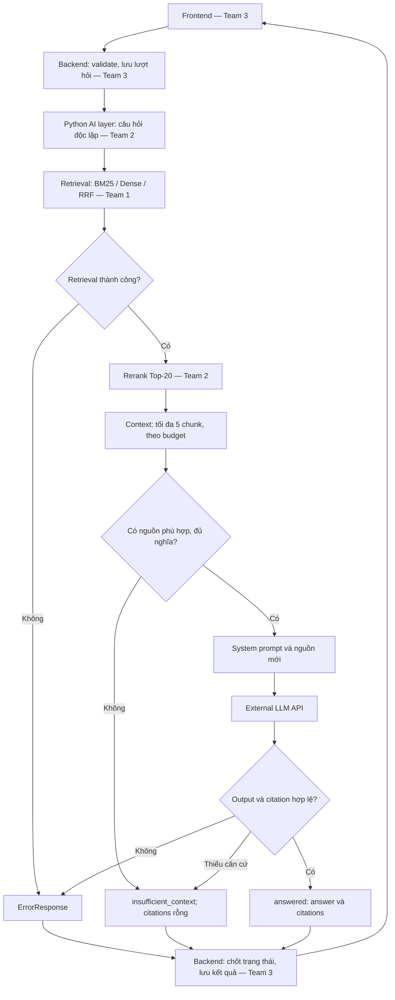

# VLRA-9 — Luồng RAG end-to-end

Week 1 chỉ thiết kế, không triển khai service. Scope: pháp luật lao động.

Q chuyển câu hỏi độc lập đã chuẩn hóa tới retrieval. Diễn giải từ history
là hướng tích hợp sau Week 1, không phải chức năng đã có.
Refusal hoặc JSON hỏng từ model là lỗi xử lý, không tự đổi thành thiếu căn cứ.

## Ownership

| Team | Trách nhiệm | Team 2 không làm thay |
| --- | --- | --- |
| 1 | Corpus, cleaning, chunking, IDs, embedding, retrieval/RRF, article store | Dữ liệu/index/Qdrant |
| 2 | Rerank, context, prompt, chọn LLM, kiểm tra citation, RagResponse | Public API/hội thoại |
| 3 | FE/BE, DB, chống gửi trùng, HTTP mapping, viewer, deployment | Frontend/backend/Docker |

Team 1/2 có thể cùng process Python tại MVP; gọi retrieve(question, top_k=20),
không bắt Team 1 tạo HTTP service riêng.

## Hai đường không qua sinh câu trả lời

- Xem lịch sử: FE → BE → DB → FE; không gọi lại RAG.
- Mở điều luật: FE → BE → AI layer → article store Team 1 → BE → FE.
  Dùng document_id + article_id từ citation, không dùng LLM viết lại nguyên văn.
  Endpoint/viewer thuộc thiết kế Team 3; không triển khai trong PR này.

Retrieval thành công nhưng rỗng/không đủ căn cứ → insufficient_context.
Index/LLM lỗi, timeout hoặc citation sai → ErrorResponse; Backend quyết định HTTP.
Chi tiết: [I/O](rag-io-specification.md). Không thêm out_of_scope trong v0.1.
