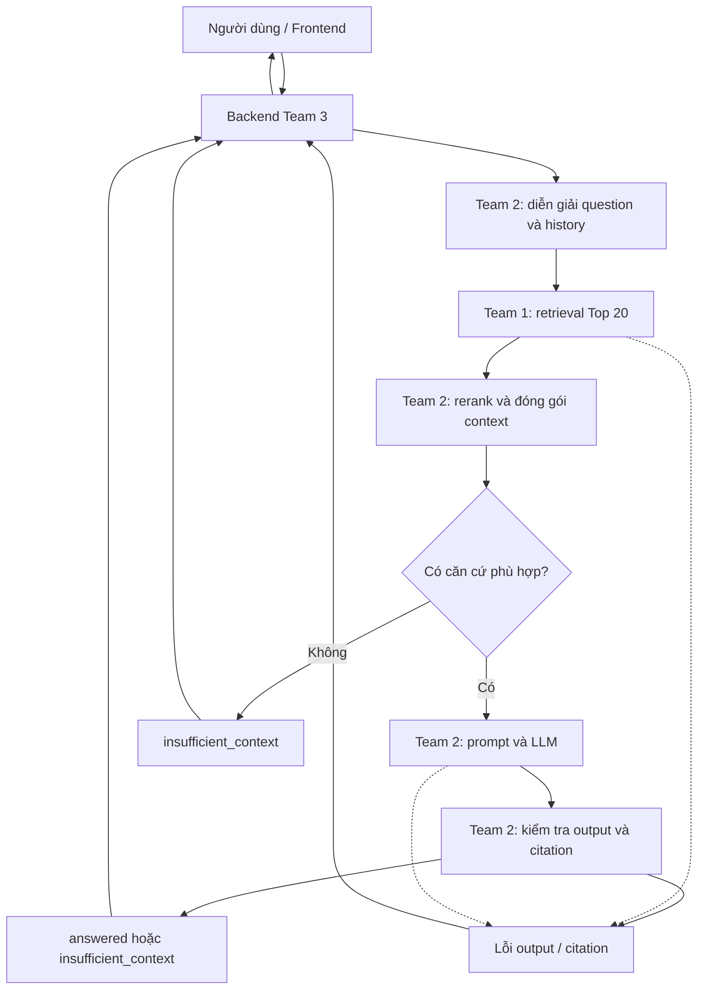

# Team 2 RAG Flow

## End-to-End Flow

Backend gửi `question` và `history` qua `POST /internal/v1/query`. Team 2 dùng history để làm rõ câu hỏi nối tiếp, gọi thư viện retrieval Team 1 trong cùng Python service, rồi dùng tối đa 5 chunk cho LLM. Frontend gọi Backend; không gọi provider LLM.

History chỉ giúp diễn giải câu hỏi, không phải nguồn pháp luật. Mỗi lượt truy xuất lại nguồn; nếu tham chiếu mơ hồ thì hỏi làm rõ bằng `insufficient_context`. Không tái sử dụng citation từ lượt trước.

## Ownership

| Stage | Owner | Ranh giới |
| --- | --- | --- |
| Corpus, chunking, metadata, BM25/dense/hybrid/RRF | Team 1 | Trả `question/results` với candidate gốc |
| Diễn giải câu hỏi, rerank, context, prompt, LLM, citation | Team 2 | Trả `status/answer/citations` đã kiểm tra |
| API, hội thoại, lưu trữ, frontend, document viewer | Team 3 | Thêm các ID và thời gian vào public response |

Backend dùng metadata `document_id/article_id` để mở nguyên văn từ nguồn Team 1; không yêu cầu LLM tái tạo điều luật. Team 2 không thiết kế lại retrieval, cơ sở dữ liệu hay UI.

## Kết quả và lỗi

- `answered`: có ít nhất một citation hợp lệ hỗ trợ câu trả lời.
- `insufficient_context`: thiếu căn cứ sau retrieval thành công hoặc câu hỏi cần làm rõ; `citations=[]`.
- Lỗi retrieval/LLM/output: dùng ErrorResponse theo [I/O](rag-io-specification.md), không đổi thành thiếu căn cứ.

Week 1 chỉ bàn giao sơ đồ và thiết kế. Nguồn đối chiếu: [Team 3, mục 1.9–2](https://github.com/Banh-Van-Hiep/vietnamese-legal-rag/blob/a80f44b248b80ea39155b8029ddc132686a1e907/docs/team3_fullstack/team3.md) và [Team 1](https://github.com/Banh-Van-Hiep/vietnamese-legal-rag/blob/a80f44b248b80ea39155b8029ddc132686a1e907/docs/team1_data/retrieval-design.md).
