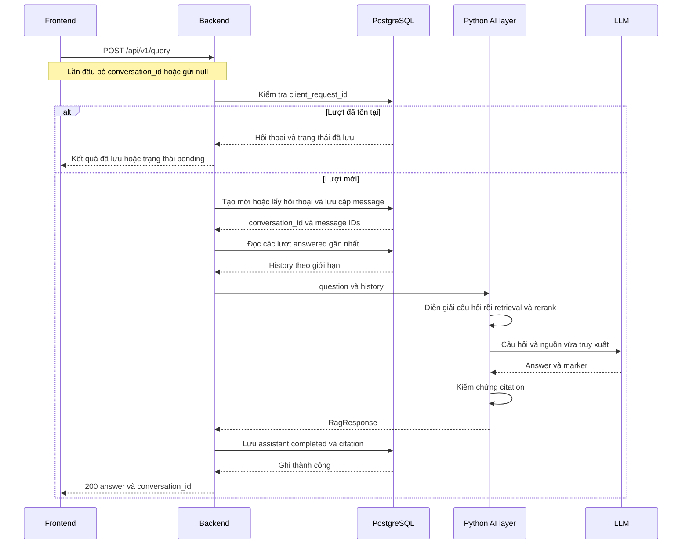
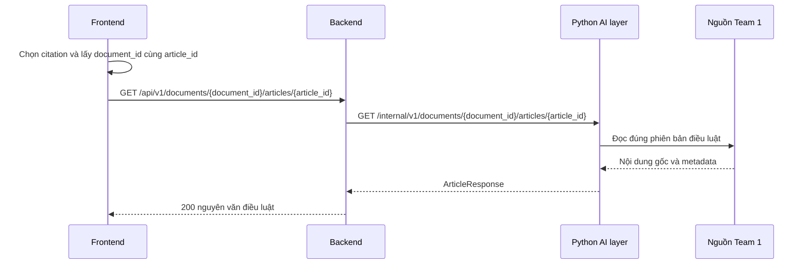

# Team 3 — Fullstack

## Responsibilities

- Backend and REST API
- Frontend and UI/UX
- Document viewer
- Integration and deployment

## Scope

Team 3 tự thiết kế implementation bên trong thư mục này. Dữ liệu trao đổi với Team 2 được thống nhất trong `contracts/`.

## Backend (`backend/`)

Spring Boot (Maven, Java) + PostgreSQL. Backend nhận câu hỏi từ frontend, gọi dịch vụ RAG của Team 2 (Python) để lấy câu trả lời kèm trích dẫn, và lưu lịch sử hội thoại.

Nguyên tắc: code chia theo tính năng (package-by-feature); mỗi tính năng gồm Controller → Service → Repository. Chỉ package `ai/` được nói chuyện với Python.

Gốc package: `backend/src/main/java/com/legalai/backend/`

### Gốc dự án

| File | Vai trò |
|---|---|
| `pom.xml` | Khai báo dependency (Spring Web MVC, JPA, Validation, PostgreSQL driver) và phiên bản Java/Spring Boot. |
| `mvnw`, `mvnw.cmd`, `.mvn/` | Maven Wrapper, chạy build mà không cần cài Maven. |
| `Dockerfile` | Đóng gói backend thành image để triển khai *(chưa có)*. |
| `src/main/resources/application.properties` | Cấu hình ứng dụng: kết nối PostgreSQL, JPA, địa chỉ dịch vụ AI (`AI_SERVICE_URL`). |
| `BackendApplication.java` | Điểm khởi chạy của Spring Boot (`main`). |
| `src/test/.../BackendApplicationTests.java` | Test kiểm tra ứng dụng khởi động được. |

### `chat/` — hỏi đáp

| File | Vai trò |
|---|---|
| `ChatController.java` | REST endpoint nhận câu hỏi từ frontend, trả câu trả lời. |
| `ChatService.java` | Xử lý luồng hỏi đáp: tạo hội thoại khi chưa có ID hoặc lấy hội thoại hiện có; lưu câu hỏi, lấy ngữ cảnh đã lưu, gọi `AiClient`, lưu câu trả lời và trích dẫn, trả `conversation_id`. |
| `dto/ChatRequest.java` | Dữ liệu vào: `question`, `client_request_id` và `conversation_id` tùy chọn. Bỏ ID hoặc gửi `null` để tạo mới; gửi ID để hỏi tiếp. |
| `dto/ChatResponse.java` | Dữ liệu ra: câu trả lời, danh sách trích dẫn, id hội thoại. |

### `conversation/` — lịch sử hội thoại

| File | Vai trò |
|---|---|
| `Conversation.java` | Entity JPA: một cuộc hội thoại (bảng `conversation`). |
| `Message.java` | Entity JPA: một tin nhắn (câu hỏi hoặc câu trả lời) thuộc một hội thoại. |
| `ConversationRepository.java` | Truy cập DB cho `Conversation` (Spring Data JPA). |
| `MessageRepository.java` | Truy cập DB cho `Message`, ví dụ lấy tin nhắn theo hội thoại. |
| `ConversationService.java` | Nghiệp vụ: tạo hội thoại, liệt kê, xem chi tiết, xóa, thêm tin nhắn. |
| `ConversationController.java` | REST endpoint cho lịch sử hội thoại (danh sách, chi tiết, xóa). |

### `document/` — xem nguyên văn điều luật

| File | Vai trò |
|---|---|
| `DocumentController.java` | REST endpoint để frontend mở nguyên văn điều luật khi bấm vào trích dẫn. |
| `DocumentService.java` | Lấy nội dung điều luật (qua `AiClient`, hoặc nguồn dữ liệu do các team thống nhất). |

### `ai/` — nơi duy nhất giao tiếp với Python (Team 2)

| File | Vai trò |
|---|---|
| `AiClient.java` | Interface: hợp đồng gọi dịch vụ AI (hỏi đáp với `question` và `history`, lấy nội dung điều luật). Các lớp khác chỉ phụ thuộc interface này. |
| `MockAiClient.java` | Cài đặt giả, trả dữ liệu mẫu để phát triển khi Team 2 chưa xong. |
| `HttpAiClient.java` | Cài đặt thật, gọi dịch vụ Python qua HTTP theo `contracts/`. |
| `dto/RagAnswer.java` | Kết quả RAG: `status`, câu trả lời và danh sách trích dẫn; dữ liệu hội thoại do Backend bổ sung. |
| `dto/Citation.java` | Một trích dẫn: văn bản/điều luật được dùng làm căn cứ. |
| `dto/LegalChunk.java` | Một đoạn văn bản luật (chunk) lấy từ dữ liệu của Team 1/2. |

Các DTO trong `ai/dto/` phải bám theo schema trong `contracts/`.

### `common/` — dùng chung *(chưa có)*

| File | Vai trò |
|---|---|
| `config/CorsConfig.java` | Cho phép frontend gọi API từ domain khác (CORS). |
| `config/` (cấu hình `AiClient`) | Chọn `MockAiClient` hay `HttpAiClient` theo cấu hình. |
| `exception/GlobalExceptionHandler.java` | Bắt lỗi tập trung, trả JSON lỗi thống nhất. |
| `exception/ApiError.java` | Cấu trúc thông báo lỗi trả về cho client. |

### `user/` — đăng nhập *(để sau, nếu cần)*

## Trạng thái

Các class hiện mới là khung (chưa có logic). Mục đánh dấu *(chưa có)* chưa được tạo. API và luồng dưới đây là đặc tả đề xuất phiên bản 1.2, chưa thể hiện các endpoint đã được triển khai. `history` và API lấy nguyên văn điều luật cần được thống nhất với Team 1/Team 2 trong `contracts/`.

## API

### 1.1 Phạm vi và quy ước

Tài liệu đặc tả hỏi đáp có trích dẫn, quản lý lịch sử hội thoại và xem nguyên văn điều luật theo README Team 3.

Contract đề xuất bổ sung hội thoại, history cho câu hỏi nối tiếp, chống gửi trùng và ID điều luật so với v0.1. Thiếu conversation_id hoặc gửi null thì tạo mới; gửi ID hợp lệ thì hỏi tiếp. Bản demo dùng chung dữ liệu, chưa có đăng nhập hoặc phân quyền.

| Quy ước | Đặc tả |
| --- | --- |
| Định dạng | JSON UTF-8; Content-Type: application/json; tên field snake_case. |
| Định danh | conversation_id, message_id và client_request_id là UUID; ví dụ JSON dùng UUID đầy đủ. |
| Thời gian | created_at và updated_at là string RFC 3339 ở UTC, ví dụ 2026-09-30T06:00:00Z. |
| Truy vết | Backend sinh X-Request-ID cho từng lần gọi HTTP, trả trong response và truyền sang Python; khác client_request_id dùng chống gửi trùng. |
| Lỗi đầu vào | Không ép kiểu; từ chối JSON hỏng, key trùng và field lạ. String trim hai đầu trước validation; độ dài tính bằng Unicode code point. |
| Phân trang | page bắt đầu từ 0, mặc định 0; size mặc định 20, từ 1 đến 100. Sai giá trị → 400. |
| Giới hạn | POST body tối đa 16 KiB; request query chỉ nhận question và các ID được đặc tả. |

### 1.2 Danh sách API công khai

| Method và endpoint | Chức năng |
| --- | --- |
| POST /api/v1/conversations | Tạo hội thoại rỗng nếu FE cần; tùy chọn. |
| GET /api/v1/conversations | Danh sách hội thoại. |
| GET /api/v1/conversations/{conversation_id} | Thông tin hội thoại. |
| GET /api/v1/conversations/{conversation_id}/messages | Lịch sử tin nhắn. |
| DELETE /api/v1/conversations/{conversation_id} | Xóa hội thoại. |
| POST /api/v1/query | Gửi câu hỏi trong hội thoại. |
| GET /api/v1/documents/{document_id}/articles/{article_id} | Xem nguyên văn điều luật. |
| GET /api/v1/health | Kiểm tra Backend đang hoạt động. |

### 1.3 Mô hình dữ liệu hội thoại và tin nhắn

#### Conversation

| Field | Kiểu | Ý nghĩa và ràng buộc |
| --- | --- | --- |
| conversation_id | string | UUID, do Backend sinh; bắt buộc. |
| title | string | 1–100 ký tự; bắt buộc. |
| created_at | string | Thời điểm tạo UTC; bắt buộc. |
| updated_at | string | Cập nhật khi tạo, nhận câu hỏi hoặc chốt kết quả; bắt buộc. |

#### Message

| Field | Kiểu | Ý nghĩa và ràng buộc |
| --- | --- | --- |
| message_id | string | UUID do Backend sinh; bắt buộc. |
| conversation_id | string | UUID của hội thoại; bắt buộc. |
| client_request_id | string | UUID gắn cặp user/assistant của một lượt hỏi; bắt buộc. |
| sequence_no | integer | Số thứ tự tăng dần trong hội thoại, bắt đầu từ 1; bắt buộc. |
| role | string | user \| assistant; bắt buộc. |
| state | string | pending \| completed \| failed; bắt buộc. |
| content | string hoặc null | Nội dung câu hỏi/trả lời; null khi assistant pending/failed. |
| answer_status | string hoặc null | answered \| insufficient_context cho assistant completed; còn lại null. |
| citations | array&lt;Citation&gt; | Luôn có; [] nếu user, pending, failed hoặc insufficient_context. |
| error_code | string hoặc null | Public error code nếu failed; còn lại null. |
| created_at | string | Thời điểm tạo message UTC; bắt buộc. |

Mỗi lượt hỏi được tiếp nhận tạo hai message: user có state=completed và assistant có state=pending. Khi xử lý xong, cập nhật chính assistant message thành completed hoặc failed; không tạo thêm assistant message khác. User message không chuyển sang failed.

Hội thoại chỉ có một lượt hỏi pending tại một thời điểm. Message sắp xếp bằng sequence_no, không dựa riêng vào timestamp. Xem lịch sử trả cả lượt thành công, đang xử lý và thất bại.

#### PageResponse

Các API danh sách trả object có items (array), page (integer ≥0), size (integer 1–100), total_elements (integer ≥0), total_pages (integer ≥0). total_pages là số trang theo size; không có dữ liệu thì bằng 0. Trang vượt cuối trả items=[] với HTTP 200.

### 1.4 API tạo xem và xóa hội thoại

#### Tạo hội thoại

POST /api/v1/conversations là cách tùy chọn để tạo hội thoại rỗng trước khi hỏi; FE cũng có thể bắt đầu trực tiếp qua POST /api/v1/query. Body bắt buộc là object. title là string tùy chọn, 1–100 ký tự nếu gửi, không nhận null; bỏ field thì dùng “Hội thoại mới”. Không tự đổi title theo câu hỏi trong bản này.

```text
Request
{"title": "Tra cứu Luật Doanh nghiệp"}
```

```text
Response 201
{
  "conversation_id": "11111111-1111-4111-8111-111111111111",
  "title": "Tra cứu Luật Doanh nghiệp",
  "created_at": "2026-09-30T06:00:00Z",
  "updated_at": "2026-09-30T06:00:00Z"
}
```

Header Location trỏ tới /api/v1/conversations/{conversation_id}. Lỗi: 400 INVALID_REQUEST; 413 PAYLOAD_TOO_LARGE; 415 UNSUPPORTED_MEDIA_TYPE; 503 PERSISTENCE_UNAVAILABLE; 500 INTERNAL_ERROR.

Bắt đầu trực tiếp bằng query: body gồm question và client_request_id, không cần conversation_id. Response query luôn trả conversation_id để FE lưu lại; hội thoại tự tạo có title mặc định “Hội thoại mới”.

#### Lấy danh sách hội thoại

GET /api/v1/conversations?page=0&size=20. Không có request body. HTTP 200 trả `PageResponse<Conversation>`. Sắp xếp updated_at giảm dần, sau đó conversation_id tăng dần để ổn định khi thời gian bằng nhau. Lỗi: 400, 503 hoặc 500.

#### Lấy thông tin hội thoại

GET /api/v1/conversations/{conversation_id}. Path là UUID bắt buộc; không có query parameter hoặc request body. HTTP 200 trả Conversation theo mục 1.3. ID sai định dạng → 400; không tồn tại → 404 CONVERSATION_NOT_FOUND; DB không sẵn sàng → 503.

#### Xóa hội thoại

DELETE /api/v1/conversations/{conversation_id}. Path là UUID bắt buộc; không có request body. Xóa hội thoại, toàn bộ message và citation đã lưu của hội thoại trong cùng một thao tác dữ liệu. Không xóa văn bản pháp luật trong corpus. Giữ dấu nhận diện client_request_id đã xóa, không giữ nội dung câu hỏi/trả lời; gửi lại lượt thuộc hội thoại đã xóa trả 404 REQUEST_NOT_FOUND, không tự tạo hội thoại mới.

| Điều kiện | Response |
| --- | --- |
| Hội thoại tồn tại và không có lượt pending | 204 No Content, body rỗng. |
| Hội thoại đang xử lý câu hỏi | 409 CONVERSATION_BUSY; không xóa. |
| ID sai định dạng | 400 INVALID_REQUEST. |
| Hội thoại không tồn tại hoặc đã xóa | 404 CONVERSATION_NOT_FOUND. |
| Không ghi được thay đổi vào DB | 503 PERSISTENCE_UNAVAILABLE. |

### 1.5 API xem lịch sử tin nhắn

GET /api/v1/conversations/{conversation_id}/messages?page=0&size=20. conversation_id là UUID bắt buộc; page và size theo quy ước mục 1.1. Không có request body. HTTP 200 trả `PageResponse<Message>`, sắp xếp sequence_no tăng dần, từ cũ đến mới.

Hội thoại tồn tại nhưng chưa có tin nhắn trả items=[], total_elements=0 và total_pages=0. Hội thoại không tồn tại trả 404 CONVERSATION_NOT_FOUND; không dùng danh sách rỗng để thay thế lỗi này.

#### Ví dụ response có một lượt đang xử lý

```json
{
  "items": [
    {
      "message_id": "22222222-2222-4222-8222-222222222222",
      "conversation_id": "11111111-1111-4111-8111-111111111111",
      "client_request_id": "44444444-4444-4444-8444-444444444444",
      "sequence_no": 1,
      "role": "user",
      "state": "completed",
      "content": "Câu hỏi dùng để kiểm thử tích hợp",
      "answer_status": null,
      "citations": [],
      "error_code": null,
      "created_at": "2026-09-30T06:01:00Z"
    },
    {
      "message_id": "33333333-3333-4333-8333-333333333333",
      "conversation_id": "11111111-1111-4111-8111-111111111111",
      "client_request_id": "44444444-4444-4444-8444-444444444444",
      "sequence_no": 2,
      "role": "assistant",
      "state": "pending",
      "content": null,
      "answer_status": null,
      "citations": [],
      "error_code": null,
      "created_at": "2026-09-30T06:01:00Z"
    }
  ],
  "page": 0,
  "size": 20,
  "total_elements": 2,
  "total_pages": 1
}
```

Khi assistant completed, content chứa answer, answer_status chứa kết quả nghiệp vụ và citations chứa nguồn đã lưu. Khi failed, content=null, answer_status=null, citations=[] và error_code có mã lỗi. FE hiển thị trạng thái theo các field này, không coi content=null là câu trả lời rỗng thành công.

Lỗi: 400 INVALID_REQUEST; 404 CONVERSATION_NOT_FOUND; 503 PERSISTENCE_UNAVAILABLE; 500 INTERNAL_ERROR. API lịch sử chỉ đọc dữ liệu Backend đã lưu, không gọi RAG để sinh lại câu trả lời.

### 1.6 API gửi câu hỏi

POST /api/v1/query trả lời đồng bộ. Bỏ conversation_id hoặc gửi null: Backend tạo hội thoại mới cùng lượt hỏi đầu tiên. Gửi UUID: hỏi tiếp trong hội thoại đó. FE sinh client_request_id cho mỗi lượt mới và giữ nguyên ID khi gửi lại lượt chưa rõ kết quả.

| Field request | Kiểu và bắt buộc | Ràng buộc |
| --- | --- | --- |
| conversation_id | string hoặc null • tùy chọn | Bỏ field/null để tạo mới; UUID để hỏi tiếp. Chuỗi rỗng hoặc sai định dạng → 400; ID không tồn tại → 404. |
| client_request_id | string • có | UUID v4 do FE sinh; duy nhất trong ứng dụng demo, kể cả khi chưa có conversation_id. |
| question | string • có | 1–2000 code point sau trim; không null hoặc toàn khoảng trắng. |

```json
{
  "conversation_id": "11111111-1111-4111-8111-111111111111",
  "client_request_id": "44444444-4444-4444-8444-444444444444",
  "question": "Câu hỏi dùng để kiểm thử tích hợp"
}
```

#### Ví dụ bắt đầu hội thoại mới

Không gửi `conversation_id` hoặc gửi `"conversation_id": null`:

```json
{
  "client_request_id": "44444444-4444-4444-8444-444444444444",
  "question": "Câu hỏi đầu tiên dùng để kiểm thử"
}
```

Backend tạo hội thoại và response luôn chứa `conversation_id`. FE giữ ID này sau thành công; nếu xử lý lỗi sau khi đã tiếp nhận, lấy ID từ header `X-Conversation-ID`.

#### Ví dụ hỏi tiếp trong cùng hội thoại

Dùng ID đã nhận và một `client_request_id` mới cho lượt hỏi mới:

```json
{
  "conversation_id": "11111111-1111-4111-8111-111111111111",
  "client_request_id": "55555555-5555-4555-8555-555555555555",
  "question": "Trường hợp vừa nêu cần những giấy tờ nào?"
}
```

#### Response với HTTP 200

| Field response | Kiểu | Ý nghĩa |
| --- | --- | --- |
| conversation_id | string | Hội thoại nhận câu hỏi. |
| client_request_id | string | ID lượt hỏi từ request. |
| user_message_id | string | ID message user đã lưu. |
| assistant_message_id | string | ID message assistant đã lưu. |
| status | string | answered \| insufficient_context. |
| answer | string | Không rỗng, tối đa 12000 code point. |
| citations | array&lt;Citation&gt; | Theo mục 1.7; luôn có, không null. |
| created_at | string | Thời điểm tạo assistant message, UTC. |

#### Gửi trùng và gửi đồng thời

Backend kiểm tra client_request_id trước khi tạo hội thoại. ID đã dùng nhưng question khác hoặc conversation_id được gửi không trùng hội thoại đã gắn → 409 REQUEST_ID_CONFLICT. Cùng lượt: pending → 409 REQUEST_IN_PROGRESS; completed → trả lại 200 đã lưu; failed → trả lỗi đã lưu. Request gửi lại thiếu/null conversation_id dùng hội thoại đã gắn, không tạo mới.

ID mới nhưng hội thoại đang có pending → 409 CONVERSATION_BUSY. Tạo hội thoại, gắn client_request_id và lưu cặp message là một thao tác nguyên tử; không tạo hai hội thoại khi request đầu bị gửi trùng. Muốn thử lại lượt đã failed, dùng ID mới và conversation_id đã nhận. Sau khi tiếp nhận, response kể cả lỗi kèm X-Conversation-ID; FE được đọc header qua CORS.

Lỗi khác: 400 đầu vào; 404 hội thoại không tồn tại; 413/415 body; 502 output AI sai; 503 dịch vụ hoặc DB không sẵn sàng; 504 timeout; 500 lỗi ngoài dự kiến. Cấu trúc lỗi tại mục 1.10.

### 1.7 Citation và ví dụ kết quả hỏi đáp

| Field Citation | Kiểu và ràng buộc |
| --- | --- |
| citation_id | string; C1…C10, duy nhất trong một answer. |
| chunk_id | string 1–200 ký tự; ID chunk đã dùng làm bằng chứng. |
| document_id | string 1–200 ký tự; ID phiên bản văn bản trong corpus. |
| article_id | string 1–100 ký tự; ID điều luật trong văn bản, dùng trong URL. |
| document_title | string 1–500 ký tự; tên văn bản. |
| article | string 1–100 ký tự; tên hiển thị, ví dụ Điều 1. |
| clause và point | Mỗi field là string 1–100 ký tự hoặc null; bắt buộc có key. |
| source_url | string; URL HTTPS tuyệt đối, tối đa 2048 ký tự. |

Mọi field Citation đều bắt buộc có key; chỉ clause và point được null. Các field public response và ArticleResponse cũng bắt buộc có mặt như bảng đặc tả.

document_id và article_id chỉ dùng chữ ASCII, số, dấu gạch dưới hoặc gạch nối. Cặp ID trỏ tới nội dung đã được lập phiên bản; không tái sử dụng để trỏ tới nội dung pháp luật đã thay đổi. Đây là hai field bổ sung cho chức năng mở nguyên văn điều luật.

answered yêu cầu ít nhất một citation; mọi marker [C1], [C2] trong answer phải ánh xạ đúng citation. Đánh số liên tục theo lần xuất hiện đầu tiên; không có citation thừa hoặc chunk trùng. Tối đa 10 citation. insufficient_context yêu cầu citations=[] và không có marker.

#### Ví dụ answered với HTTP 200

Dữ liệu dưới đây chỉ là mock về cấu trúc, không phải nội dung pháp luật.

```json
{
  "conversation_id": "11111111-1111-4111-8111-111111111111",
  "client_request_id": "44444444-4444-4444-8444-444444444444",
  "user_message_id": "22222222-2222-4222-8222-222222222222",
  "assistant_message_id": "33333333-3333-4333-8333-333333333333",
  "status": "answered",
  "answer": "Nội dung trả lời kiểm thử dựa trên đoạn mẫu [C1].",
  "citations": [{
    "citation_id": "C1",
    "chunk_id": "mock_v1_art1_clause1",
    "document_id": "mock_v1",
    "article_id": "art1",
    "document_title": "Văn bản kiểm thử",
    "article": "Điều 1",
    "clause": "Khoản 1",
    "point": null,
    "source_url": "https://example.com/mock-law"
  }],
  "created_at": "2026-09-30T06:01:00Z"
}
```

Với insufficient_context, giữ các ID và created_at; đặt status="insufficient_context", answer="Tài liệu được truy xuất chưa đủ căn cứ để trả lời." và citations=[]. Đây vẫn là kết quả thành công HTTP 200 và assistant state=completed.

### 1.8 API xem nguyên văn điều luật và health

#### Xem nguyên văn điều luật

GET /api/v1/documents/{document_id}/articles/{article_id}. Hai path parameter bắt buộc, theo định dạng tại mục 1.7; không có request body hoặc query parameter. Frontend lấy ID từ Citation, không phân tích chuỗi tên hiển thị article để tạo ID.

| Field response | Kiểu và ý nghĩa |
| --- | --- |
| document_id | string; đúng phiên bản văn bản được yêu cầu. |
| document_title | string; tên văn bản. |
| article_id | string; đúng ID điều luật được yêu cầu. |
| article | string; nhãn hiển thị điều luật. |
| content | string không rỗng; toàn bộ nội dung điều luật gồm các khoản/điểm, dạng plain text giữ xuống dòng. |
| source_url | string URL HTTPS; nguồn văn bản. |

```text
GET /api/v1/documents/mock_v1/articles/art1
```

```text
Response 200
{
  "document_id": "mock_v1",
  "document_title": "Văn bản kiểm thử",
  "article_id": "art1",
  "article": "Điều 1",
  "content": "Nội dung đầy đủ của điều luật dùng để kiểm thử.",
  "source_url": "https://example.com/mock-law"
}
```

Giới hạn document_title/article/source_url như Citation; content tối đa 200000 code point. Backend chỉ trả nội dung do nguồn dữ liệu cung cấp, không gọi LLM để viết lại hay ghép các chunk thành nguyên văn.

Lỗi: 400 INVALID_REQUEST nếu ID sai định dạng; 404 DOCUMENT_NOT_FOUND hoặc ARTICLE_NOT_FOUND; 502 UPSTREAM_INVALID_RESPONSE nếu schema/ID phản hồi sai; 503 SERVICE_UNAVAILABLE nếu nguồn dữ liệu không sẵn sàng; 504 UPSTREAM_TIMEOUT; 500 INTERNAL_ERROR.

Nếu phiên bản điều luật không còn truy xuất được, trả 404; không thay bằng phiên bản khác một cách âm thầm. FE vẫn có thể mở source_url của citation và hiển thị câu trả lời đã lưu.

#### Kiểm tra Backend

GET /api/v1/health. Không có parameter hoặc request body. HTTP 200 trả {"status":"up"}. API này chỉ kiểm tra Backend đang phục vụ HTTP, không gọi AI, LLM hoặc truy xuất điều luật; không thể hiện toàn pipeline đã sẵn sàng.

### 1.9 API và dữ liệu tích hợp nội bộ

#### Backend gọi RAG

POST /internal/v1/query nhận question và history. Backend truyền X-Request-ID; sở hữu việc lưu hội thoại và không gửi conversation_id/client_request_id sang Python. history là field bổ sung cần thống nhất với Team 2; không gọi implementation chỉ hỗ trợ question rồi mặc nhiên coi đã có hỏi đáp nhiều lượt.

HTTP 200 trả RagResponse gồm status, answer, citations; ý nghĩa và schema theo mục 1.6–1.7. Python không sinh user_message_id hoặc assistant_message_id. Backend bổ sung các ID này vào public response từ dữ liệu của lượt hỏi đã lưu.

Lỗi nội bộ dùng envelope error tại mục 1.10. 400: input sai; 502: INVALID_LLM_OUTPUT hoặc CITATION_INVALID; 503: RETRIEVAL_UNAVAILABLE hoặc LLM_UNAVAILABLE; 504: RETRIEVAL_TIMEOUT hoặc LLM_TIMEOUT; 500: lỗi nội bộ ngoài dự kiến.

#### Ví dụ request Backend gửi Team 2

```json
{
  "question": "Trường hợp vừa nêu cần những giấy tờ nào?",
  "history": [
    {"role": "user", "content": "Câu hỏi trước dùng để kiểm thử"},
    {"role": "assistant", "content": "Câu trả lời trước dùng để kiểm thử"}
  ]
}
```

Đây là dữ liệu mẫu kiểm thử cấu trúc. Với hội thoại mới, `history` bằng `[]`.

#### Ngữ cảnh cho câu hỏi tiếp theo

history là array các object {role, content}, thứ tự từ cũ đến mới. role chỉ là user hoặc assistant; content là string không rỗng. Hội thoại mới gửi []; hội thoại cũ gửi tối đa 5 lượt hoàn tất gần nhất có answer_status=answered, mỗi lượt gồm user rồi assistant. Không gửi lượt hiện tại, pending, failed hoặc insufficient_context. Tổng content không quá 20000 code point; bỏ nguyên lượt cũ nhất đến khi đạt giới hạn. Body nội bộ tối đa 256 KiB.

Team 2 dùng history để diễn giải tham chiếu và tạo câu hỏi truy xuất độc lập, rồi truy xuất lại nguồn hiện tại. History không phải bằng chứng pháp luật và marker cũ không được dùng làm citation mới. Nếu không xác định được ý người dùng, trả insufficient_context kèm yêu cầu làm rõ, không tự đoán.

#### Backend lấy nguyên văn điều luật

GET /internal/v1/documents/{document_id}/articles/{article_id}, kèm X-Request-ID. Response 200 cùng schema public ArticleResponse ở mục 1.8. AI layer truy cập nguồn dữ liệu của Team 1; đường lấy điều luật không chạy sinh câu trả lời bằng LLM.

404 DOCUMENT_NOT_FOUND/ARTICLE_NOT_FOUND được giữ nguyên khi trả public API. Timeout nội bộ → 504; nguồn dữ liệu không sẵn sàng → 503; phản hồi sai → 502. Endpoint này là phần bổ sung để Team 3 triển khai document viewer.

### 1.9.1 Dữ liệu retrieval giữa Team 1 và Team 2

Interface retrieve(question, top_k=20) nhận question đã được Team 2 diễn giải từ câu hỏi và history, tối đa 4000 code point; trả object có cùng question và results. results là array tối đa top_k candidate, sắp theo rank tăng dần. top_k từ 1 đến 50. Khi truy xuất thành công nhưng không có kết quả, trả []; lỗi index phải phát sinh lỗi, không trả danh sách rỗng.

| Nhóm field của candidate | Ràng buộc |
| --- | --- |
| chunk_id, document_id, article_id | string không rỗng; ID nhất quán với Citation và API xem điều luật. |
| content | string không rỗng; nội dung chunk gốc, tối đa 20000 code point. |
| document_title, article, clause, point, source_url | Giữ metadata nguồn; giới hạn và null theo mục 1.7. |
| score | number hữu hạn; không phải xác suất đúng. |
| rank | integer 1…N liên tục, duy nhất; thứ tự chính thức của candidate. |
| retrieval_method | bm25 \| dense \| hybrid_rrf. |

Team 2 rerank, chọn tối đa 5 chunk phù hợp với giới hạn context và tạo citation từ metadata thật. document_id đã có trong retrieval contract gốc; article_id là field bổ sung. Nội dung bị cập nhật phải có định danh phiên bản mới để citation cũ vẫn có nghĩa.

### 1.10 Lỗi và thời hạn phản hồi

Mọi lỗi của API nghiệp vụ trả ErrorResponse có một field error; không trả đồng thời answer hoặc status nghiệp vụ. code là string máy đọc, message là string tiếng Việt an toàn, retryable là boolean. HTTP 204 không có body; health dùng schema riêng.

```json
{
  "error": {
    "code": "UPSTREAM_TIMEOUT",
    "message": "Dịch vụ xử lý chưa phản hồi trong thời hạn.",
    "retryable": true
  }
}
```

| HTTP | Public code | Retryable |
| --- | --- | --- |
| 400 | INVALID_REQUEST | false |
| 404 | CONVERSATION_NOT_FOUND; DOCUMENT_NOT_FOUND; ARTICLE_NOT_FOUND; REQUEST_NOT_FOUND; NOT_FOUND | false |
| 405 | METHOD_NOT_ALLOWED; kèm header Allow | false |
| 409 | REQUEST_ID_CONFLICT | false |
| 409 | REQUEST_IN_PROGRESS; CONVERSATION_BUSY | true |
| 413 / 415 | PAYLOAD_TOO_LARGE / UNSUPPORTED_MEDIA_TYPE | false |
| 500 | INTERNAL_ERROR | false |
| 502 | UPSTREAM_INVALID_RESPONSE; UPSTREAM_CONTRACT_ERROR; UPSTREAM_ERROR | false |
| 503 | SERVICE_UNAVAILABLE; PERSISTENCE_UNAVAILABLE; PROCESSING_INTERRUPTED | true |
| 504 | UPSTREAM_TIMEOUT | true |

INVALID_LLM_OUTPUT/CITATION_INVALID → 502 UPSTREAM_INVALID_RESPONSE. LLM_TIMEOUT/RETRIEVAL_TIMEOUT → 504 UPSTREAM_TIMEOUT. LLM_UNAVAILABLE/RETRIEVAL_UNAVAILABLE → 503 SERVICE_UNAVAILABLE. Request nội bộ query bị AI từ chối 4xx → 502 UPSTREAM_CONTRACT_ERROR. Lỗi 404 document hợp lệ được chuyển nguyên như mục 1.9; lỗi lạ → 502 UPSTREAM_ERROR.

Thiếu căn cứ sau khi retrieval thành công → HTTP 200 insufficient_context. Không dùng trạng thái đó cho lỗi LLM, lỗi index, timeout hoặc lỗi DB. Không trả stack trace, API key hoặc lỗi thô từ provider.

#### Thời hạn và cách thử lại

Query: AI tối đa 45 giây; Backend gọi AI tối đa 50 giây, trong đó connect tối đa 2 giây; FE chờ tối đa 60 giây. Document: Backend gọi nội bộ tối đa 10 giây; FE chờ 15 giây. Backend không tự retry việc gọi LLM.

retryable=true cho biết thao tác có thể thực hiện lại sau khi xử lý nguyên nhân. Khi mất kết nối/chưa rõ kết quả query, FE giữ client_request_id và kiểm tra lịch sử hoặc gửi lại cùng request. Sau khi biết lượt cũ đã failed, hỏi lại bằng ID mới; không tự tạo ID mới chỉ vì FE timeout.

## Luồng tích hợp hệ thống

### 2.1 Luồng tạo hội thoại và hỏi đáp thành công



1. FE gửi question và client_request_id. Lần đầu bỏ conversation_id hoặc gửi null; các lần sau gửi ID đã nhận. 2–3. Backend validate, kiểm tra request trùng, tạo hội thoại mới nếu cần hoặc lấy hội thoại được chỉ định; ID không tồn tại trả 404, không tự thay bằng hội thoại mới.

4. Backend lưu nguyên tử hội thoại mới nếu có, khóa client_request_id, user message và assistant pending; cấp sequence_no, cập nhật updated_at. Đọc history theo mục 1.9. Nếu tiếp nhận hoặc lấy ngữ cảnh thất bại thì trả 503; không gọi Python.

5–9. Backend gửi question cùng history. Team 2 diễn giải câu hỏi nối tiếp, gọi retrieval Team 1, rerank, tạo context, gọi LLM và kiểm tra citation với nguồn vừa truy xuất; không coi lịch sử là bằng chứng.

10–11. Backend kiểm tra schema/marker, lưu answer và citation, chuyển completed rồi trả 200 cùng conversation_id. FE giữ ID để hỏi tiếp và hiển thị kết quả. Nếu đã tiếp nhận nhưng xử lý lỗi, X-Conversation-ID vẫn giúp FE tìm lượt trong lịch sử. Chờ AI diễn ra ngoài transaction DB.

### 2.2 Luồng thiếu căn cứ và lỗi xử lý

| Điểm phát sinh | Luồng xử lý và trạng thái cuối |
| --- | --- |
| Đầu vào không hợp lệ | Backend trả 400; không tạo message, không gọi AI. |
| Hội thoại không tồn tại | Trả 404; không tự tạo hội thoại thay thế. |
| Không ghi được lượt hỏi ban đầu | Trả 503 PERSISTENCE_UNAVAILABLE; không gọi AI. |
| Retrieval thành công nhưng thiếu căn cứ | Team 2 bỏ qua LLM hoặc từ chối kết luận không đủ bằng chứng; trả insufficient_context. Backend lưu assistant completed với citations=[] và trả 200. |
| Retrieval/index hoặc dịch vụ AI không sẵn sàng | Backend đánh dấu assistant failed, lưu lỗi; trả 503 SERVICE_UNAVAILABLE. |
| Timeout retrieval hoặc LLM | Backend đánh dấu assistant failed, content=null; trả 504 UPSTREAM_TIMEOUT. |
| Output/marker/citation sai | Team 2 hoặc Backend chặn kết quả; lưu failed, không lưu answer như kết quả hợp lệ; trả 502. |
| Không đọc được history sau khi tiếp nhận | Lưu assistant failed khi có thể, trả 503 PERSISTENCE_UNAVAILABLE; không gọi AI. |
| Có answer nhưng ghi kết quả vào DB thất bại | Không trả thành công. Trả 503 PERSISTENCE_UNAVAILABLE; FE kiểm tra lịch sử bằng cùng client_request_id trước khi hỏi lại. |
| Backend bị ngắt khi đang xử lý | Lượt pending còn lưu được đối soát; quá 60 giây từ khi tạo mà chưa có kết quả thì chuyển failed với PROCESSING_INTERRUPTED. |

#### Quy tắc chốt trạng thái

Assistant chỉ đi từ pending sang completed hoặc failed. Khi đã chốt trạng thái, response AI đến muộn không được ghi đè. Việc chốt trạng thái phải kiểm tra trạng thái hiện tại một cách nguyên tử để tránh tác vụ timeout và tác vụ trả kết quả cùng ghi.

Nếu DB chưa phục hồi, lượt pending có thể chưa được cập nhật ngay. Khi DB hoạt động trở lại, Backend thực hiện đối soát trước khi tiếp nhận lượt mới hoặc trả lịch sử liên quan; pending quá hạn được chuyển failed. Không tự gọi lại LLM trong bước đối soát.

#### Hiển thị trên Frontend

FE phân biệt ba nhóm: 200 answered hiển thị câu trả lời và nguồn; 200 insufficient_context hiển thị thông báo thiếu căn cứ; non-2xx hiển thị lỗi theo code và X-Request-ID. Tin nhắn failed không được hiển thị như câu trả lời pháp luật.

### 2.3 Luồng gửi lại và quản lý lịch sử

#### Gửi lại sau khi mất kết nối

1. FE giữ client_request_id và conversation_id nếu đã nhận. 2. Nếu chưa nhận ID ở lượt đầu, gửi lại cùng request thiếu/null conversation_id; nếu đã có ID, có thể xem lịch sử. 3. Backend tìm client_request_id trước khi tạo hội thoại, rồi dùng hội thoại đã gắn để xử lý kết quả.

| Kết quả kiểm tra khóa lượt | Hành vi |
| --- | --- |
| Chưa có lượt | ID hội thoại thiếu/null thì tạo mới; có ID thì kiểm tra tồn tại và bận trước khi tiếp nhận. |
| Có lượt nhưng question không trùng | 409 REQUEST_ID_CONFLICT; không thay nội dung lượt cũ. |
| Lượt đang pending | 409 REQUEST_IN_PROGRESS; FE tiếp tục hiển thị chờ hoặc tải lại lịch sử. |
| Lượt đã completed | Trả response 200 đã lưu, không tạo message hoặc gọi AI lần nữa. |
| Lượt đã failed | Trả lỗi đã lưu. Người dùng muốn hỏi lại thì tạo client_request_id mới. |
| ID mới trong khi lượt khác đang pending | 409 CONVERSATION_BUSY; không tạo thêm message. |

#### Mở và xem lịch sử hội thoại

1. FE gọi GET /api/v1/conversations. 2. Backend lấy dữ liệu đã lưu và trả danh sách có phân trang. 3. Người dùng chọn hội thoại; FE gọi GET /api/v1/conversations/{id}/messages. 4. Backend đối soát pending quá hạn nếu có, rồi trả message theo sequence_no. 5. FE hiển thị content, state và citation đã lưu.

Xem lịch sử không gọi AI. Tải tin nhắn mới nhất bằng trang cuối theo total_pages. Khi hỏi tiếp, FE gửi conversation_id; Backend chủ động lấy history đã lưu theo mục 1.9, FE không gửi lại toàn bộ lịch sử. Chọn “Hội thoại mới” thì bỏ ID cho query kế tiếp.

#### Xóa hội thoại

1. Người dùng chọn xóa và FE yêu cầu xác nhận. 2. FE gửi DELETE với conversation_id. 3. Backend kiểm tra tồn tại và pending trong cùng thao tác bảo vệ dữ liệu. 4. Nếu đang xử lý thì trả 409; nếu không thì xóa hội thoại cùng message/citation và trả 204. 5. FE bỏ mục tương ứng khỏi danh sách, đóng vùng nội dung nếu đang xem hội thoại đó.

Nếu một request query và một request xóa đến đồng thời, chỉ một thao tác được tiếp nhận trước: query đã tạo pending thì xóa nhận 409; xóa đã hoàn tất thì query nhận 404. Không để câu trả lời được lưu vào hội thoại đã xóa.

### 2.4 Luồng mở trích dẫn và xem điều luật



1. FE tìm Citation tương ứng với marker được bấm trong answer. 2. FE lấy document_id và article_id từ citation để gọi API; không sử dụng tên hiển thị làm khóa truy xuất.

3–6. Backend kiểm tra ID, chuyển request sang AI layer. AI layer lấy toàn điều luật từ nguồn Team 1 và trả metadata cùng content gốc. Đây là đường đọc dữ liệu; không gọi LLM để sinh hoặc diễn giải điều luật.

7. Backend kiểm tra ID trong phản hồi trùng request, trả ArticleResponse. FE hiển thị tên văn bản, nhãn điều, nội dung và liên kết nguồn; có thể nhấn mạnh khoản/điểm được citation chỉ ra nếu xác định đúng vị trí.

#### Các nhánh thay thế

Nếu nguồn không có phiên bản tương ứng, trả 404; FE thông báo chưa mở được nội dung và cung cấp source_url từ citation. Nếu nguồn timeout hoặc không sẵn sàng, trả 504 hoặc 503; câu trả lời và lịch sử đã lưu vẫn giữ nguyên.

Người dùng cũng có thể chọn “Mở nguồn gốc”: FE mở source_url trực tiếp trong tab mới. Backend không tải URL tùy ý do người dùng nhập và không thay nguồn citation khi việc mở điều luật thất bại.