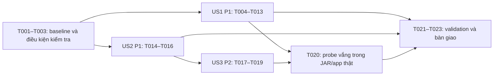

# Tasks: Task01 — Nền tảng Backend/API Team 3

Ghi chú tổ chức tài liệu 09/10/2026: đường dẫn báo cáo trong tài liệu này là vị trí bàn giao
hiện tại (verification.md trong spec); baseline/log gốc vẫn ghi đường dẫn docs/ trước khi chuyển.
Snapshot lúc plan và checkbox/evidence đã kiểm chứng được giữ nguyên; không chạy lại test khi dọn tài liệu.

**Input**: [spec.md](spec.md), [plan.md](plan.md), [research.md](research.md), [data-model.md](data-model.md), [contracts/README.md](contracts/README.md), [quickstart.md](quickstart.md).  
**Ngày**: 2026-10-09. **Nhánh giữ nguyên**: `feature/team3/tuan`.  
**Trạng thái**: Đã thực hiện và kiểm chứng local 23/23 task ngày 2026-10-09; [báo cáo/bằng chứng](verification.md#6-kiểm-chứng-spec-t01-riêng-ngày-09102026). Không xác nhận toàn tuần 2 hoặc UI.

Nguồn API/luồng/kiến trúc là `docs/team3_fullstack/team3.md`, đã được Team 3 thống nhất theo Q1;
`docs/team3_fullstack/team3-week2-spec.md` xác định phạm vi T01. Báo cáo Codex và code chỉ mô tả
triển khai/bằng chứng, không quyết định phê duyệt. Q2–Q3 đã đóng, không hỏi lại hoặc chọn nguồn khác.

**Tests**: Spec và yêu cầu của Tuấn có kiểm chứng AC; dùng test hiện có, chỉ bổ sung khoảng trống.
Không áp đặt TDD, coverage hoặc framework mới. Thứ tự harness trước sửa runner giúp quan sát lỗi Q2;
không yêu cầu làm test đang đúng thất bại hoặc dựng lại tính năng đã có.

**Format**: `- [ ] Txxx [P?] [USx?] Công việc với đường dẫn`. Các đường dẫn tính từ repository root.
`[P]` chỉ cho phép làm cùng công việc độc lập được nêu bên dưới, sau khi đủ prerequisite.
Mỗi checkbox chỉ chuyển hoàn thành khi có kết quả kiểm chứng đúng nội dung task.

## Đối chiếu trước triển khai — tránh giao lại phần đã có

Rà soát source và diff trên HEAD `bb1bb26017d2c90578635a29ad625e502dee09b6` cùng working tree
chưa commit. Có 7 đường dẫn tracked thay đổi, staged diff rỗng và các file untracked.
Các thay đổi này có từ trước; không quy toàn bộ code đang đọc cho HEAD.

| Phần đã có qua đọc code/diff | Công việc còn lại trong danh sách |
| --- | --- |
| `team3_fullstack/backend/pom.xml`, wrapper: Java 25, Spring Boot 4.1.1, Maven 3.9.16, dependency web/validation/JPA/PostgreSQL/test | Kiểm tra runtime và build; không khởi tạo project hoặc upgrade dependency |
| `team3_fullstack/backend/run-local.ps1`: EnvFile/Port/AllowedOrigins, kiểm tra JDK/mock, Maven nonzero và finally | Sửa parse/chọn nguồn Q2; giữ và kiểm chứng các hành vi đã có |
| `team3_fullstack/backend/src/main/resources/application*.properties`, `ai/MockAiClient.java`: default mock, loại DB, hai status mock | Kiểm chứng cấu hình thực tế; không tạo lại mock client, profile hay DB |
| `team3_fullstack/backend/src/main/java/com/legalai/backend/common/config/CorsConfig.java`: origin, preflight, expose header và validation | Assertion method/header và Location actual còn thiếu; không rewrite CORS |
| `team3_fullstack/backend/src/main/java/com/legalai/backend/common/exception/GlobalExceptionHandler.java`, `common/web/`: envelope/trace/body limit/406 | Kiểm chứng và bổ sung assertion retryable=false; giữ xử lý 406 |
| `team3_fullstack/backend/src/test/java/com/legalai/backend/BackendConfigurationTests.java`: no DataSource, MockAiClient, CORS và test-only probe 500/503/504 | Chạy lại có bằng chứng; không tạo probe hoặc endpoint lỗi mới |
| `team3_fullstack/backend/src/test/java/com/legalai/backend/MockApiTests.java`: health, input errors, Allow, CORS hai nhóm origin; Location hiện chưa kèm Origin | Bổ sung assertion nhỏ, tái sử dụng các ca đã có |
| `team3_fullstack/backend/src/test/powershell/RunLocalConfigurationTests.ps1` chưa tồn tại | Bổ sung harness runner; các fixture/log dưới target là output kiểm tra |
| `specs/001-t01-backend-foundation/verification.md`: báo cáo lịch sử 07/10 và đính chính nguồn | Hướng dẫn Q2 và bằng chứng mới; không dùng 24 test PASS cũ để nghiệm thu mới |

Không giao việc tạo controller/service/DTO/entity/migration, nối Python/RAG, sửa UI, streaming/auth
hoặc hoàn thiện fixture/history của T02. Không sửa `contracts/` chung hoặc code Team 1/2.
Giữ việc người dùng đã chuyển tài liệu: không phục hồi `team3_fullstack/backend/README.md`.
Không sửa `team3_fullstack/backend/.env` thật. Các đường dẫn target và harness mới dưới đây
là **dự kiến tạo khi triển khai**, chưa tồn tại không có nghĩa task hoàn thành.

Task nháp Q2 được thay bằng danh sách này: **T001 cũ → T007–T009/T022**;
**T002 cũ → T004–T006/T010/T012–T013/T022**. Hai ý định sửa runner và kiểm tra cấu hình trùng
được giữ, không sinh spec/task file thứ hai.

## Phase 1: Setup — chuẩn bị trên project hiện có

**Mục đích**: Bảo toàn thay đổi và xác nhận môi trường, không khởi tạo skeleton mới.

- [X] T001 Ghi baseline nhánh/HEAD, git status, staged/unstaged diff và hash các file dự kiến tác động của `team3_fullstack/backend/`, `specs/001-t01-backend-foundation/verification.md`, `specs/001-t01-backend-foundation/` vào `team3_fullstack/backend/target/t01/baseline.txt`; phân biệt tracked/untracked và README đã xóa, không reset/stash/switch branch.
- [X] T002 Đối chiếu `team3_fullstack/backend/pom.xml` và `team3_fullstack/backend/.mvn/wrapper/maven-wrapper.properties` với JDK/Maven/PowerShell thực tế; ghi lệnh/version và JDK 25 dùng kiểm tra vào `team3_fullstack/backend/target/t01/environment.txt`; giữ dependency/runtime hiện có, báo rõ nếu chưa đủ môi trường thay vì đánh dấu build đạt.

## Phase 2: Foundational — điều kiện chung để kiểm chứng

**Mục đích**: Xác định test isolation và nơi ghi bằng chứng cho mọi story.

- [X] T003 Kiểm tra `team3_fullstack/backend/src/main/resources/application.properties`, `team3_fullstack/backend/src/main/resources/application-mock.properties`, `team3_fullstack/backend/src/test/java/com/legalai/backend/BackendConfigurationTests.java` và `specs/001-t01-backend-foundation/quickstart.md`; ghi ma trận AC-T01-01–08 ban đầu là chưa chạy, fixture/port/PID dự kiến và test-only probe vào `team3_fullstack/backend/target/t01/verification.md`; bảo đảm fixture không dùng .env thật, không cần AI/key/DB và không chỉnh production để tạo lỗi.

**Checkpoint**: Có môi trường JDK 25 và kế hoạch cô lập; không có kết luận PASS runtime ở đây.
Các task story bắt đầu sau T003. Nếu prerequisite chưa kiểm tra được, ghi giới hạn và để mở.

## Phase 3: US1 — chạy Backend mock local (P1, MVP)

**Mục tiêu**: Chạy mock/health, chọn cấu hình đúng Q2 và báo lỗi khởi động rõ ràng.

**Kiểm tra độc lập**: Không cần UI hoặc dịch vụ AI; harness runner đạt, wrapper package đạt,
health 200/up, hai bộ port/origin/status đúng nguồn thắng; default và lỗi không tạo readiness giả.
Bao phủ AC-T01-01–03. Maven stub chỉ chứng minh runner, không chứng minh Spring bind.

### Kiểm tra runner cần bổ sung

- [X] T004 [US1] Tạo harness standalone tại `team3_fullstack/backend/src/test/powershell/RunLocalConfigurationTests.ps1`: fixture env và Maven stub dưới `team3_fullstack/backend/target/t01/`, capture effective env/goal/exit, gọi runner trong cùng process và snapshot/cleanup biến/location; dùng JDK 25 thật theo T002, không thêm Pester/framework hoặc sửa .env thật.
- [X] T005 [US1] Bổ sung ma trận ưu tiên/fallback vào `team3_fullstack/backend/src/test/powershell/RunLocalConfigurationTests.ps1`: Port/AllowedOrigins explicit thắng terminal/file; terminal thắng file cho cả năm key hỗ trợ; file thắng nguồn vắng; nguồn vắng để env server trống cho Spring default, JAVA_HOME vẫn cần JDK; dùng giá trị khác nhau để phát hiện lỗi Q2 cũ và ghi expected/actual ban đầu, không coi stub là proof default Spring.
- [X] T006 [US1] Bổ sung ca lỗi/restoration vào `team3_fullstack/backend/src/test/powershell/RunLocalConfigurationTests.ps1`: key rỗng được khai báo, winner sai không lấy giá trị file thấp hơn, file chỉ định không tồn tại, .env mặc định vắng trong bản runner cô lập, syntax/key không hỗ trợ, JDK/profile sai, Maven nonzero; sau success/failure kiểm tra env có/vắng và location như trước. Với lỗi semantic do Spring/CorsConfig/MockAiClient chịu trách nhiệm, kiểm tra runner chuyển đúng winner rồi dành proof khởi động lỗi cho T013.

### Sửa phần còn thiếu và kiểm chứng

- [X] T007 [US1] Sửa parse/chọn nguồn trong `team3_fullstack/backend/run-local.ps1`: snapshot process trước parse, đọc .env thành dữ liệu thay vì gán env theo từng dòng, chọn explicit > process > file > Spring default theo từng key; giữ quoting/whitelist/lỗi parser. Kế thừa đúng constraint: “Một key được runner hiện hỗ trợ: JAVA_HOME, SPRING_PROFILES_ACTIVE, SERVER_PORT, CORS_ALLOWED_ORIGINS, MOCK_ANSWER_STATUS”; “Nguồn vắng cho phép fallback; giá trị được chọn không hợp lệ đi tới lỗi, không chọn lại nguồn thấp hơn để che lỗi.” Không thêm CLI parameter; explicit chỉ Port/AllowedOrigins.
- [X] T008 [US1] Hoàn thiện apply/validation/finally trên `team3_fullstack/backend/run-local.ps1`: phát hiện winner rỗng trước khi gán env làm mất key; giữ kiểm tra semantic tại lớp hiện có, goal/exit Maven và khôi phục env/location mọi đường success/failure. Constraint kế thừa: JAVA_HOME “Không có default; đường dẫn chứa bin/javac.exe, runner kiểm tra JDK 25”; profile “Không cung cấp thì Spring dùng default mock; runner hiện chỉ hỗ trợ mock”; Port “`-Port` hiện nhận 1–65535”; status “MockAiClient hiện nhận answered hoặc insufficient_context”. Default port/origin/status tiếp tục thuộc `team3_fullstack/backend/src/main/resources/application.properties`, không nhân bản vào runner hoặc thay policy CorsConfig.
- [X] T009 [P] [US1] Sửa chú thích thứ tự ưu tiên/cơ chế nạp trong `team3_fullstack/backend/.env.example` thành explicit > terminal > .env > Spring defaults; giữ key/default hiện có và ghi JAVA_HOME cần JDK 25 hợp lệ; không sửa .env local. Có thể làm cùng T004–T008 sau T003 vì file độc lập.
- [X] T010 [US1] Chạy `team3_fullstack/backend/src/test/powershell/RunLocalConfigurationTests.ps1` trên runner đã sửa; đối chiếu toàn bộ ca T005/T006, lưu command/expected/actual/exit/restoration vào `team3_fullstack/backend/target/t01/runner-tests.log`; mọi ca fail hoặc chưa chạy vẫn để mở, không báo đạt AC-T01-02 chỉ từ đọc code.
- [X] T011 [US1] Chạy `team3_fullstack/backend/run-local.ps1 -Task package` với fixture kiểm tra kiểm soát, dùng wrapper hiện có `team3_fullstack/backend/mvnw.cmd`; lưu build log và kết quả test mock/no DataSource/health vào `team3_fullstack/backend/target/t01/package-us1.log` cùng `team3_fullstack/backend/target/surefire-reports/`; xác nhận JAR tạo được, không AI/key/DB thật (AC-T01-01).
- [X] T012 [US1] Thực hiện hai bộ smoke A/B và ca Spring default theo `specs/001-t01-backend-foundation/quickstart.md`, ghi lệnh/PID/port/health/preflight/query status và log profile vào `team3_fullstack/backend/target/t01/config-smoke.log`: A terminal thắng file, B explicit thắng terminal cho port/origin và file thắng khi status terminal vắng. Ca default phải bỏ SPRING_PROFILES_ACTIVE, SERVER_PORT, CORS_ALLOWED_ORIGINS, MOCK_ANSWER_STATUS ở terminal lẫn fixture, không truyền tham số ép profile/port/origin, giữ JAVA_HOME JDK 25 hợp lệ; xác nhận log tiến trình mới không ép active profile và default profile thực tế là mock, port 8080/origin localhost và 127.0.0.1:5173/status answered. Dùng fixture default riêng dưới target, không sửa source/.env; port default bận thì ghi chưa đạt ca default, không đọc health server cũ hoặc chỉ dựa health để kết luận profile.
- [X] T013 [US1] Chạy các ca khởi động lỗi còn cần Spring thực qua `team3_fullstack/backend/run-local.ps1`: port invalid, CORS/status winner invalid dù nguồn thấp có giá trị đúng, và tiến trình thứ hai dùng port đang bị smoke chiếm; lưu thông báo/exit/PID vào `team3_fullstack/backend/target/t01/startup-failures.log`, chứng minh tiến trình thất bại không sẵn sàng (AC-T01-03 và phần invalid winner của AC-T01-02). Cleanup chỉ process/fixture đã tạo, helper nền dùng cửa sổ Hidden; không kill theo tên java/node.

**Checkpoint US1**: T004–T013 có bằng chứng tương ứng. Có thể demo Backend mock local;
chưa coi CORS toàn bộ, lỗi toàn bộ hoặc UI/T02–T06 đã nghiệm thu.

## Phase 4: US2 — origin dev và header truy vết (P1)

**Mục tiêu**: Nghiệm thu CORS cho phép/từ chối và header có ý nghĩa trên thành công/lỗi.

**Kiểm tra độc lập**: Test HTTP với RANDOM_PORT/origin kiểm soát và mock hiện có, không cần
runner hoặc UI; preflight đúng method/header, actual/error cấp đúng origin và expose header;
origin ngoài danh sách không có Allow-Origin. Bao phủ AC-T01-04–05; không bắt JSON 403.

### Assertion còn thiếu

- [X] T014 [P] [US2] Bổ sung assertion preflight trong `team3_fullstack/backend/src/test/java/com/legalai/backend/BackendConfigurationTests.java`: Access-Control-Allow-Methods chứa POST và Allow-Headers cho Content-Type của request JSON; so token không phụ thuộc case/thứ tự. Giữ assertions origin/error/expose hiện có, không sửa production CORS hoặc tự biến toàn bộ danh sách triển khai thành contract mới; độc lập với các file sửa US1 và T015 sau T003.
- [X] T015 [P] [US2] Bổ sung Origin cho ca tạo conversation và assertion Location actual + Access-Control-Allow-Origin/Expose-Headers trong `team3_fullstack/backend/src/test/java/com/legalai/backend/MockApiTests.java`; xác nhận Location trỏ đúng tài nguyên vừa tạo và X-Request-ID có mặt. Tái sử dụng endpoint/ca query trace đã có, chỉ kỳ vọng X-Conversation-ID khi thao tác biết hội thoại; không tạo ID giả. Độc lập với T014 và US1 sau T003, phải xong trước T017 cùng file.

### Kiểm chứng phần đã có và phần bổ sung

- [X] T016 [US2] Chạy focused tests `BackendConfigurationTests` và `MockApiTests` bằng `team3_fullstack/backend/mvnw.cmd` trên môi trường cô lập sau T014/T015; lưu kết quả vào `team3_fullstack/backend/target/t01/cors-tests.log` và surefire reports. Đối chiếu preflight/actual/error origin cho phép, request/conversation/Location khi phù hợp, và preflight/actual origin ngoài danh sách không Allow-Origin; không thêm điều kiện body JSON 403, không sửa 406 (AC-T01-04–05).

**Checkpoint US2**: Có bằng chứng header/CORS phía Backend, không thay nghiệm thu UI T04.
CORS/trace production đã có; chỉ giao assertion thiếu và chạy kiểm chứng.

## Phase 5: US3 — lỗi HTTP tách khỏi kết quả nghiệp vụ (P2)

**Mục tiêu**: Error envelope/status/retryable an toàn và truy vết sau khi tiếp nhận lượt.

**Kiểm tra độc lập**: Chạy các ca HTTP lỗi và test-only probe/mock AiClient có sẵn; xác nhận
400/404/405/413/415 và 500/503/504, không answer/status hoặc chi tiết nhạy cảm; probe vắng
trên ứng dụng thật. Bao phủ AC-T01-06–07, không cần Team 2/LLM hoặc fixture demo T02.

### Assertion còn thiếu

- [X] T017 [US3] Sau T015/T016, bổ sung kiểm tra `retryable=false` cho các lỗi đầu vào 400/404/405/413/415 trong `team3_fullstack/backend/src/test/java/com/legalai/backend/MockApiTests.java`; tái sử dụng error helper/ca hiện có, kiểm tra Content-Type JSON, message an toàn/không rỗng, trace và root chỉ error nếu assertion còn thiếu. Giữ 405 Allow và 413 theo constraint “POST body tối đa 16 KiB”; không sửa DTO/giới hạn body hoặc biến 406 thành yêu cầu nghiệm thu.

- [X] T018 [US3] Mở rộng ca lỗi đã tiếp nhận trong `team3_fullstack/backend/src/test/java/com/legalai/backend/MockQueryServiceTests.java` cho AiClient ném RuntimeException chứa chi tiết kiểm thử cần che: service trả ApiException 500/INTERNAL_ERROR, retryable=false, conversation ID của đúng lượt đã tiếp nhận và message an toàn/không rỗng, không answer/status nghiệp vụ. Bổ sung ca HTTP tương ứng trong `team3_fullstack/backend/src/test/java/com/legalai/backend/BackendConfigurationTests.java` qua POST /api/v1/query hiện có, dùng AI lỗi được cô lập chỉ trong test: response HTTP 500/envelope đúng, X-Conversation-ID trùng hội thoại nhận lượt, X-Request-ID có mặt, message không lộ chi tiết RuntimeException/provider/secret/stack trace. Tái sử dụng store/test setup và giữ các ca MockAiClient/probe hiện có độc lập; không sửa production, thêm endpoint, field hoặc scenario public.

### Kiểm chứng cơ chế lỗi hiện có

- [X] T019 [US3] Chạy focused `MockApiTests`, `BackendConfigurationTests`, `MockQueryServiceTests` bằng `team3_fullstack/backend/mvnw.cmd`; ghi HTTP/public code, retryable, envelope/trace vào `team3_fullstack/backend/target/t01/error-tests.log`: 400 INVALID_REQUEST, 404 NOT_FOUND, 405 METHOD_NOT_ALLOWED + Allow, 413 PAYLOAD_TOO_LARGE, 415 UNSUPPORTED_MEDIA_TYPE đều false; 500 INTERNAL_ERROR false, 503 SERVICE_UNAVAILABLE true, 504 UPSTREAM_TIMEOUT true. Chạy cả ca mới T018 để xác nhận RuntimeException → HTTP 500 sau tiếp nhận, conversation ID đúng lượt và message an toàn; probe 500 chưa tiếp nhận không thay bằng chứng này. Tái dùng probe/test lỗi hiện có cho các nhánh khác, xác nhận không answer/status/insufficient_context, không raw provider/stack/secret, X-Conversation-ID khi có nghĩa; không tạo probe mới hoặc gọi AI thật.
- [X] T020 [US3] Kiểm tra JAR `team3_fullstack/backend/target/backend-0.0.1-SNAPSHOT.jar` và ứng dụng mock chạy thật theo `specs/001-t01-backend-foundation/quickstart.md`: probe test không được đóng gói, `GET /api/v1/t01-error-probe/timeout` không phải endpoint tạo lỗi và trả 404/NOT_FOUND; lưu JAR listing/HTTP response vào `team3_fullstack/backend/target/t01/probe-isolation.log`, không sửa production để tạo ca 500/503/504.

**Checkpoint US3**: Bằng chứng lỗi đủ AC-T01-06–07. 406/NOT_ACCEPTABLE vẫn là hành vi
triển khai hiện có, ngoài contract/nghiệm thu T01; không xóa hoặc thay handler vì lý do đó.

## Phase 6: Polish — kiểm chứng tổng hợp và tài liệu bàn giao

- [X] T021 Sau mọi sửa runner/test, chạy harness `team3_fullstack/backend/src/test/powershell/RunLocalConfigurationTests.ps1` và final package qua `team3_fullstack/backend/run-local.ps1 -Task package`; dùng `specs/001-t01-backend-foundation/quickstart.md` đối chiếu bộ validation, lưu log vào `team3_fullstack/backend/target/t01/final-validation.log` và giữ báo cáo surefire cuối. Không dùng -DskipTests, không chạy Maven đồng thời hay lặp smoke đã đạt trên cùng nội dung nếu không có thay đổi/failure mới; kiểm tra mọi bằng chứng gắn đúng working tree cuối.
- [X] T022 Cập nhật hướng dẫn Q2 và ma trận từng AC-T01-01–08 trong `specs/001-t01-backend-foundation/verification.md` từ kết quả thực T001–T021: nguồn yêu cầu, commit/working tree/runtime, lệnh, expected/actual, pass/fail/chưa kiểm tra và log path; giữ tách lịch sử 07/10 khỏi bằng chứng mới. Ghi mock memory mất sau restart, AI/DB/UI/T02–T06 ngoài nghiệm thu, khác biệt schema liên team giữ theo spec; không đổi phê duyệt hoặc ghi PASS khi chưa chạy (AC-T01-08).
- [X] T023 Đối chiếu git status/diff/hash với `team3_fullstack/backend/target/t01/baseline.txt`, rà scope các file của `team3_fullstack/backend/` và `specs/001-t01-backend-foundation/verification.md`; xác nhận không mất thay đổi cũ, không sửa Frontend/Team 1/2/contracts chung/.env và không phục hồi README đã chuyển. Kiểm tra evidence T022 rồi cập nhật checkbox tương ứng trong `specs/001-t01-backend-foundation/tasks.md` chỉ cho task thực sự đạt; lưu mục chưa kiểm tra/fail, không commit/push/merge hoặc đánh dấu toàn T01 nếu AC còn thiếu.

## Dependencies & execution order

Phụ thuộc dưới đây là prerequisite **trước khi làm/chốt task**, không phải bằng chứng hoàn thành.
Thứ tự mặc định đi theo ID; [P] chỉ mở các nhóm được chỉ rõ, không tự song song build/test.

| Task | Phụ thuộc |
| --- | --- |
| T001 | Không |
| T002 | T001 |
| T003 | T002 |
| T004 | T003 |
| T005 | T004 |
| T006 | T005 |
| T007 | T006 |
| T008 | T007 |
| T009 | T003 |
| T010 | T006, T008, T009 |
| T011 | T010 |
| T012 | T011 |
| T013 | T012 |
| T014 | T003 |
| T015 | T003 |
| T016 | T014, T015 |
| T017 | T015, T016 |
| T018 | T017 |
| T019 | T018 |
| T020 | T011, T019 |
| T021 | T013, T016, T019, T020 |
| T022 | T021 |
| T023 | T022 |

US2 không phụ thuộc behavior runner của US1: có thể kiểm tra bằng wrapper với môi trường
đúng sau T003. US3 có dependency biên tập T015/T016 vì cùng `MockApiTests.java`, không phải
contract lỗi phụ thuộc CORS. T020 cần JAR US1. Khi muốn nghiệm thu riêng US3 trước khi US1
xong, các test T019 vẫn độc lập; việc chốt đủ US3 phải chờ kiểm tra app thật T020.

## Parallel examples theo story

- **US1**: Sau T003, T009 sửa `.env.example` song song chuỗi T004–T008 sửa harness/runner.
  Chuỗi T004–T006 cùng harness và T007–T008 cùng runner luôn tuần tự.
- **US2**: Sau T003, T014 (`BackendConfigurationTests.java`) và T015 (`MockApiTests.java`)
  độc lập; có thể cùng phần sửa file US1. Chỉ chạy T016 khi các file Java đang dùng đã ổn định.
- **US3**: Không task [P] nội bộ. T017 phải sau T015/T016 vì chia sẻ MockApiTests.java;
  T018 làm sau T017/T016 và sau T014 đã chỉnh BackendConfigurationTests.java. Không để
  hai người cùng sửa file test hoặc dùng chung surefire output; T019 chạy sau các bổ sung này.

Không chạy Maven/package/focused tests đồng thời với sửa Java, Maven khác hoặc smoke đang
chia sẻ port/output. T011/T016/T019/T021 dùng `target/surefire-reports/`: chạy nối tiếp,
giữ tóm tắt kết quả từng lần trong log riêng trước khi báo cáo bị lần sau ghi đè.
Các nhóm [P] chỉ dành cho sửa file độc lập; không cho phép cạnh tranh process environment.

## Truy vết AC và định nghĩa hoàn thành

| Tiêu chí | Task cung cấp bằng chứng |
| --- | --- |
| AC-T01-01 | T002, T003, T011, T012, T021 |
| AC-T01-02 | T005–T010, T012, T013 |
| AC-T01-03 | T006, T008, T010, T013 |
| AC-T01-04 | T014–T016 |
| AC-T01-05 | T016 |
| AC-T01-06 | T017, T019 |
| AC-T01-07 | T018, T019, T020 |
| AC-T01-08 | T001–T003, T021–T023 |

Mỗi task cần kết quả tương ứng, ngày/lệnh hoặc thao tác, expected/actual và phạm vi đã kiểm tra.
Task sửa file phải có diff đúng mục tiêu và kiểm tra thích hợp (parser/harness/test liên quan);
task chạy kiểm tra cần log thật và exit/result; task tài liệu cần truy vết các kết quả thực.
Không đánh dấu hoàn thành từ sự tồn tại class/test, đọc source, báo cáo cũ hoặc task được sinh.
Maven stub không đủ để chốt AC về Spring; build đạt không đủ để chốt CORS/UI/lỗi mọi nhánh.

## Implementation strategy

1. **MVP**: T001–T013 (US1). Giữ project hiện có; sửa đúng Q2, kiểm chứng harness/package/
   smoke/lỗi khởi động. Đây là MVP chạy Backend mock, không phải hoàn thành toàn T01.
2. **Increment US2**: T014–T016; chốt bằng chứng CORS/header độc lập, giữ Q3.
3. **Increment US3**: T017–T020; kiểm chứng lỗi hệ thống/input và probe chỉ trong test.
4. **Bàn giao T01**: T021–T023 sau đủ story; tổng hợp AC, hướng dẫn và diff bảo toàn.

Có thể dùng các nhóm [P] để làm file độc lập sớm; mặc định tuần tự theo ID thuận tiện
cho một người. Không thêm feature hoặc “cleanup” ngoài kế hoạch để làm đầy phase.
T001–T023 đã thực hiện và kiểm chứng local; không còn task T01 mở. Bằng chứng mới:
wrapper package 25/25 test Java, harness 31/31 ca runner, smoke A/B/default và các ca
khởi động lỗi nonzero, kiểm tra JAR/probe, diff/hash bảo toàn; xem báo cáo mục 6.
Các vòng sinh/cập nhật tài liệu trước implement không tự xác nhận hoàn thành.
Sau rà soát C1 thêm T018; ID T018–T022 của danh sách 22 task trước chuyển thành T019–T023.
Hai task nháp Q2 vẫn được ánh xạ theo ID hiện tại ở đầu tài liệu.
Checklist chất lượng spec được giữ nguyên marker, không dùng checkbox task để đánh dấu
nghiệm thu UI, T02–T06, AI thật hoặc toàn tuần 2.
